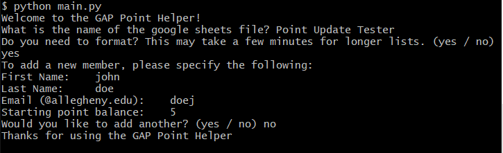
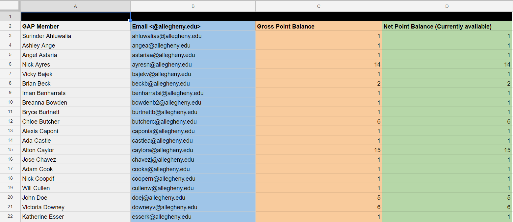

GAP Point Helper
----------------

I created this short Python program to assist me in managing the point reward system for Gator Activities Programming. This system allows GAP members to redeem points in exchange for merchandise. The Point Helper program assists this system by automating data entry into a publically viewable google spreadsheet. The point spreadsheet must use a specific format, as seen in the example. An example copy of the google sheet is available below

Installation
------------

Requirements: Python 2.7+ or 3+
This program also requires [pygsheets](https://github.com/nithinmurali/pygsheets) to operate

```
pip install pygsheets
```

or

```
pip install https://github.com/nithinmurali/pygsheets/archive/master.zip
```

Basic Usage
-----------

1. First you need to obtain [OAuth2 credentials from Google Developers Console](https://gspread.readthedocs.io/en/latest/oauth2.html)

2. Place the generated .json file in the src directory renamed as client_secret.json

3. Make a copy of the [point balance sheet](https://docs.google.com/spreadsheets/d/1gR468chU87wFQN4Tz8VoAngKNFZcYbhj6D-RxGcvyLg/edit?usp=sharing) example to your own google drive. This sheet has pre-entered values as an example, but you can add your own.

4. Share the copied balance sheet with the client email found in client_secret.json (The program will remind you if you forget)

5. If done correctly, you should be able to enter the name of the google sheet when prompted!

Example
-------

On the first run of the program I recommended formatting the names when prompted so every first and last name is capitilized

There is currently only one method, and that is to add a new member to the balance sheet, sorted alphabetically by last name.
A full run through should look like this in the terminal:



Which has the following result on the spread sheet:



